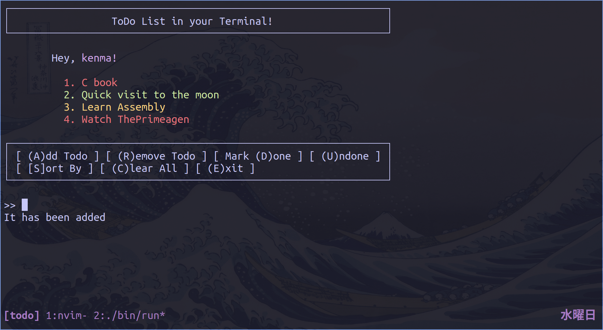
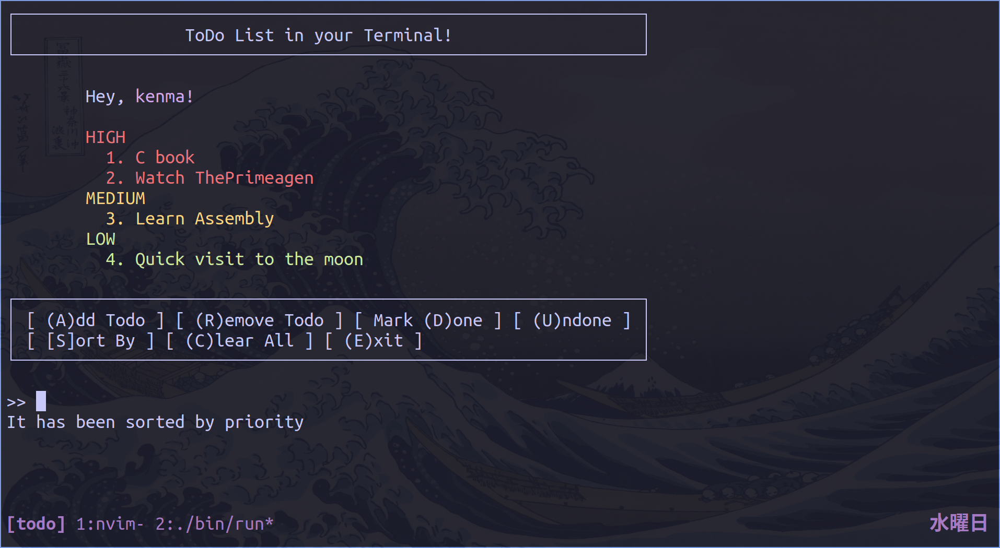
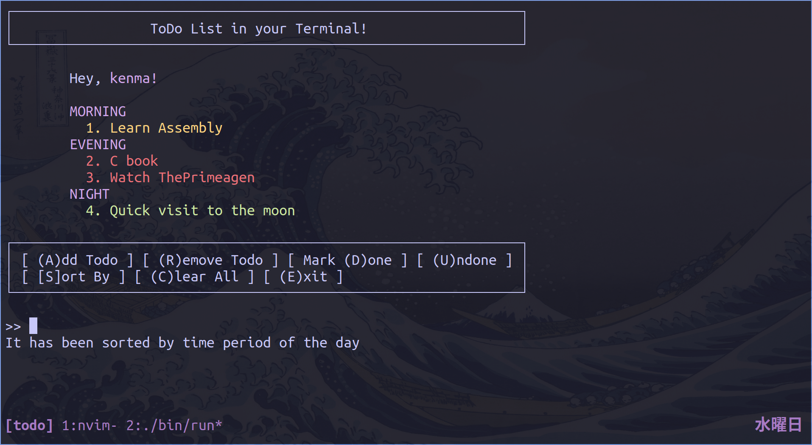

# ToDoTerm
Minimal ToDo list for terminal.

## Dependencies
1. ```gcc```
2. ```make```

## Installation

### Build from Source
```
$ git clone https://github.com/diomedescerda/ToDoTerm.git
$ cd ToDoTerm
$ make
```
Then copy ```bin/ToDoTerm``` to your ```$PATH```.

### Interactive CLI

```
$ ToDoTerm
```





